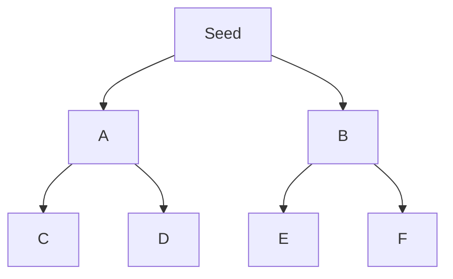
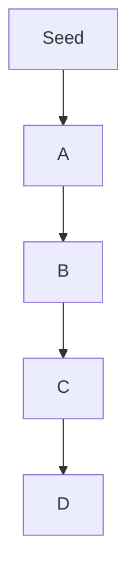

# Web Crawling: Essentials

**Web crawling** (spidering) is the automated process of systematically browsing the web to discover and collect information by following links.

## How Crawlers Work
- Start from a seed URL
- Fetch page, extract links
- Add new links to queue
- Repeat for each link

## Crawling Strategies

### Breadth-First
- Explores all links at the current depth before going deeper
- Good for mapping site structure



### Depth-First
- Follows one path as deep as possible before backtracking
- Good for reaching deep content



## What Crawlers Extract
- **Links:** Internal & external URLs
- **Comments:** User or code comments
- **Metadata:** Titles, descriptions, keywords
- **Sensitive Files:** Backups, configs, logs

## robots.txt:
- **robots.txt** is a text file in a website's root that tells crawlers which URLs they can/can't access.
- Follows the Robots Exclusion Standard; most legitimate bots respect it.

**Example:**
```txt
User-agent: *
Disallow: /private/
Allow: /public/
Sitemap: https://www.example.com/sitemap.xml
```

**Key Directives:**
- `User-agent`: Target bot (e.g., *, Googlebot)
- `Disallow`: Paths bots shouldn't crawl
- `Allow`: Paths bots can crawl
- `Crawl-delay`: Wait time between requests
- `Sitemap`: Link to sitemap

**Why it matters:**
- Prevents server overload
- Hides sensitive or private areas from search engines
- Not enforceable—malicious bots may ignore it

**Recon tip:**
- Disallowed paths can reveal hidden or sensitive directories/files
- Analyzing robots.txt helps map site structure and spot potential targets 

## Using Python & Scrapy: ReconSpider
Web crawling is vast and intricate, but you don't have to embark on this journey alone. Tools like Python's Scrapy framework automate crawling, making it faster and more efficient so you can focus on analyzing the data.

**ReconSpider.py** (in this folder) is a powerful crawler built with Scrapy. It systematically explores a target website, extracting a wide range of data and saving the results in a structured JSON file.

### Results Overview
Each key in the JSON file represents a different type of data extracted from the target website:

| JSON Key        | Description                                      |
|-----------------|--------------------------------------------------|
| emails          | Lists email addresses found on the domain.        |
| links           | Lists URLs of links found within the domain.      |
| external_files  | Lists URLs of external files such as PDFs.        |
| js_files        | Lists URLs of JavaScript files used by the site.  |
| form_fields     | Lists form fields found on the domain.            |
| images          | Lists URLs of images found on the domain.         |
| videos          | Lists URLs of videos found on the domain.         |
| audio           | Lists URLs of audio files found on the domain.    |
| comments        | Lists HTML comments found in the source code.     |
 