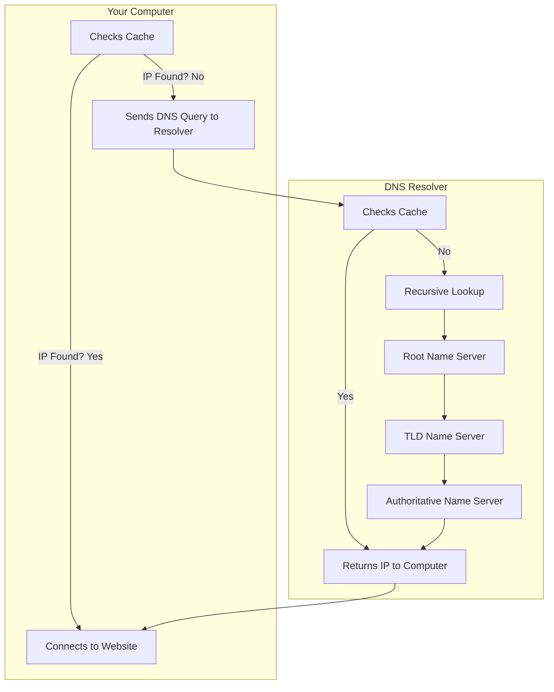
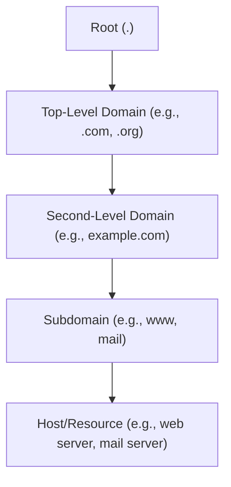

# DNS

**Domain Name System (DNS)** is the Internet's phonebook, translating human-friendly domain names (like www.example.com) into IP addresses. DNS is distributed—no central database—using thousands of name servers worldwide.

## How DNS Works
Imagine you want to visit a website like www.example.com. You type this friendly domain name into your browser, but your computer doesn't understand words – it speaks the language of numbers, specifically IP addresses. So, how does your computer find the website's IP address? Enter DNS, the internet's trusty translator.

1. **Your Computer Asks for Directions (DNS Query):**
   - Your computer checks its cache for the IP address. If not found, it asks a DNS resolver (usually your ISP).
2. **The DNS Resolver Checks its Map (Recursive Lookup):**
   - The resolver checks its own cache. If still not found, it starts querying the DNS hierarchy, beginning with a root name server.
3. **Root Name Server Points the Way:**
   - The root server doesn't know the exact address but directs the resolver to the TLD name server (e.g., for .com).
4. **TLD Name Server Narrows It Down:**
   - The TLD server knows which authoritative name server handles the domain (e.g., example.com) and points the resolver there.
5. **Authoritative Name Server Delivers the Address:**
   - The authoritative server provides the correct IP address for the domain.
6. **The DNS Resolver Returns the Information:**
   - The resolver gives the IP address to your computer and caches it for future use.
7. **Your Computer Connects:**
   - With the IP address, your computer connects to the website's server and loads the page.

## DNS Server Types
| Server Type                | Description |
|----------------------------|-------------|
| **DNS Root Server**        | Handles top-level domains (TLDs). There are 13 root servers globally, coordinated by ICANN. |
| **Authoritative Nameserver** | Holds authority for a specific zone; provides binding answers for its domains. |
| **Non-authoritative Nameserver** | Not responsible for a zone; collects info via recursive/iterative queries. |
| **Caching DNS Server**     | Caches DNS info for a set time, as determined by authoritative servers. |
| **Forwarding Server**      | Forwards DNS queries to another server. |
| **Resolver**               | Performs name resolution locally (on your computer or router). |

## DNS Hierarchy

## DNS Records
| Record | Description |
|--------|-------------|
| **A**      | Returns IPv4 address for a domain. |
| **AAAA**   | Returns IPv6 address for a domain. |
| **MX**     | Lists mail servers for a domain. |
| **NS**     | Lists nameservers for a domain. |
| **TXT**    | Stores arbitrary text (e.g., SPF, DMARC, validation info). |
| **CNAME**  | Alias for another domain name. |
| **PTR**    | Reverse lookup: IP to domain name. |
| **SOA**    | Info about the DNS zone and admin contact. |

The **SOA** record is found in a domain's zone file and specifies who manages the domain and how DNS info is handled.

## DNS Security & Privacy
- DNS is mostly unencrypted; ISPs and others can see your queries.
- Solutions: DNS over TLS (DoT), DNS over HTTPS (DoH), DNSCrypt.

## More Than Just IPs
- DNS can reveal mail servers, nameservers, and other service info for a domain.

## Common DNS Commands
| Command | Objective |
|---------|-----------|
| `dig soa <url>` | Get the SOA (Start of Authority) record for a domain. |
| `dig ns <url> @<ip>` | Query a specific DNS server for nameservers of a domain. |
| `dig CH TXT version.bind <ip>` | Check the version of a DNS server. |
| `dig any <url> @<ip>` | Get all available DNS records for a domain from a specific server. |
| `dig axfr <url> @<ip>` | Attempt a DNS zone transfer (if allowed). |
| `dnsenum --dnsserver <ip> --enum -p 0 -s 0 -o subdomains.txt -f wordlist <host/ip>` | Enumerate subdomains using a wordlist and a specific DNS server. |
